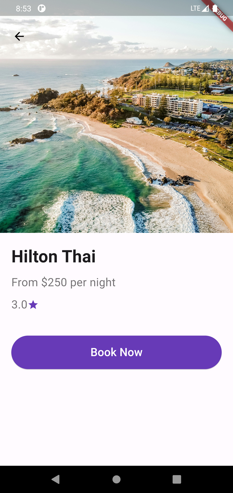

# Travel UI Flutter App

This is a simple Flutter travel app showcasing various hotels and allowing users to book them. The app features a beautiful UI with a list of hotels, each displaying an image, name, rating, and price. Users can navigate to a detailed booking page for each hotel.

## Features

- Display a list of hotels with images, names, ratings, and prices.
- Navigate to a detailed hotel booking page.
- Book a hotel and confirm the booking via a dialog.

## Screenshots

  
  
  

