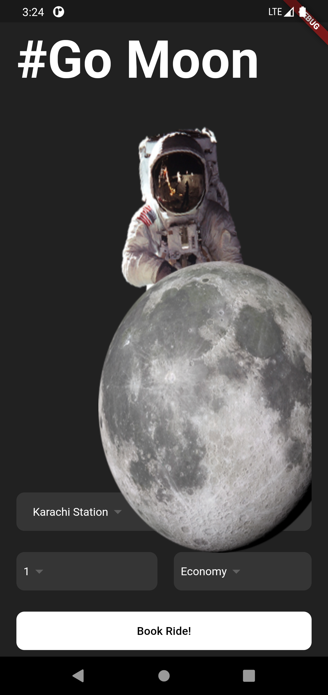

# Go Moon 🚀

Welcome to the **Go Moon** Flutter project! This project demonstrates the basics of building a Flutter application with custom widgets and responsive design.

## Description

This project is a simple Flutter application that includes:

- A home page with a title and an astronaut image.
- A form to book a ride, including destination and traveler information using custom dropdown widgets.

If you have any new ideas for features or improvements, or if you find any errors, feel free to contact me. I'm always open to feedback and collaboration!

## Screenshots

  

