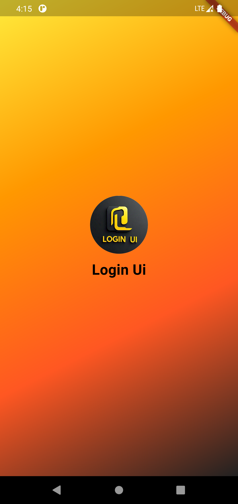
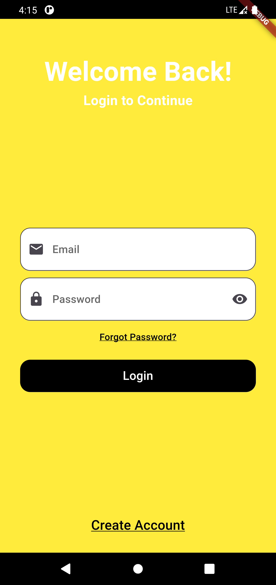
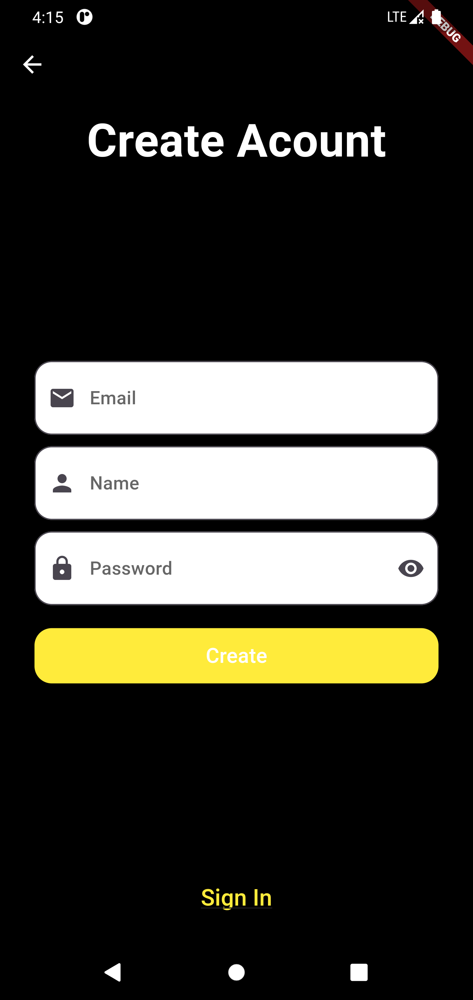

# Login UI Flutter App

This is a simple Flutter login app showcasing various features including a splash screen, login page, and registration page. The app features a beautiful UI with responsive design elements.

## Features

- Splash screen with a transition to the login page.
- Login page with email and password fields, 'Forgot Password' link, and 'Create Account' link.
- Registration page with fields for email, name, and password, and a 'Sign In' link.
- Responsive design for different screen sizes.

## Screenshots

  
  
  

