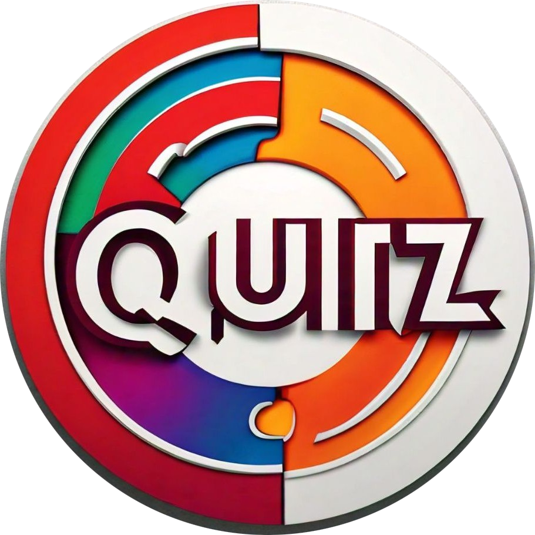
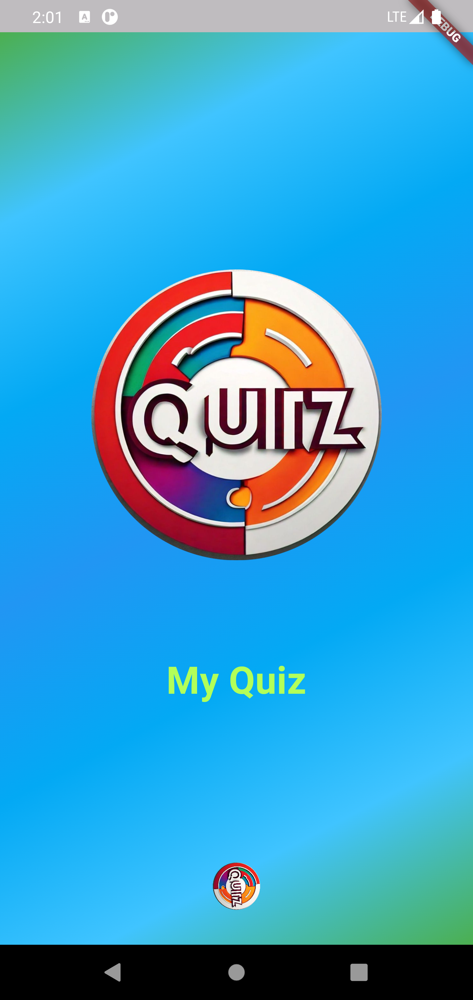
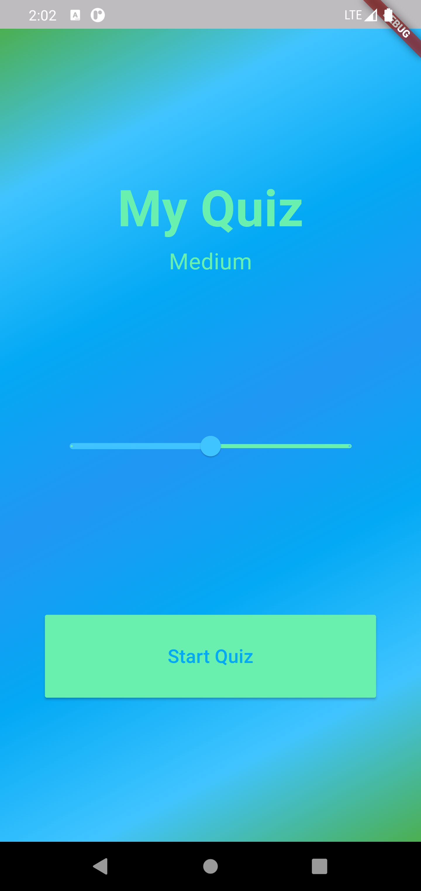
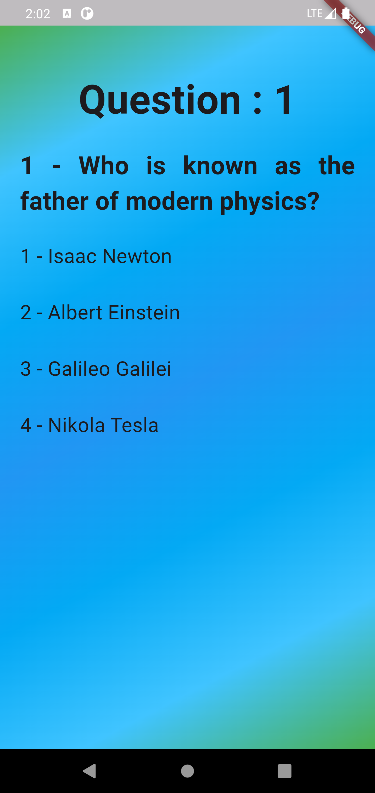
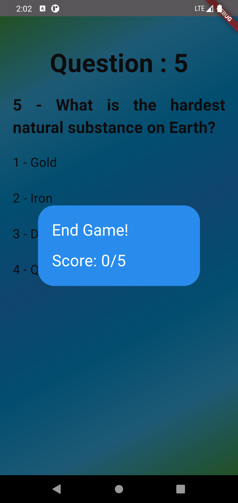

# My Quiz App

## Overview

Welcome to the **My Quiz App**, a fun and interactive quiz application built with Flutter. This app features a beautifully designed interface, dynamic quiz functionality, and is responsive to different screen sizes using the `ScreenUtil` package.

## Features

- **Splash Screen**: A visually appealing splash screen with rotating animation.
- **Difficulty Slider**: Choose the difficulty level (Easy, Medium, Hard) for your quiz.
- **Responsive Design**: Layouts adapt to different screen sizes and orientations.
- **Dynamic Questions**: Quiz questions and answers are dynamically loaded based on the selected difficulty level.
- **Scoring**: Keep track of your score and get a summary at the end of the quiz.

## Screenshots

  
  
  
  

## Contributing
Feel free to open issues or submit pull requests if you find bugs or have suggestions for improvements

## License

This project is licensed under the MIT License. See the [LICENSE file](https://github.com/AbaidAliMiran/Flutter-Projects/blob/main/LICENSE) for details.
